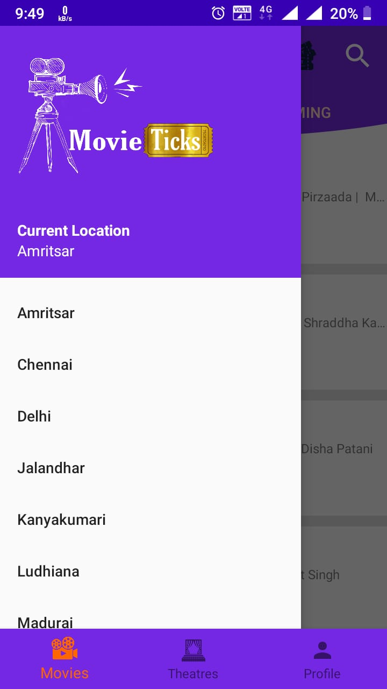
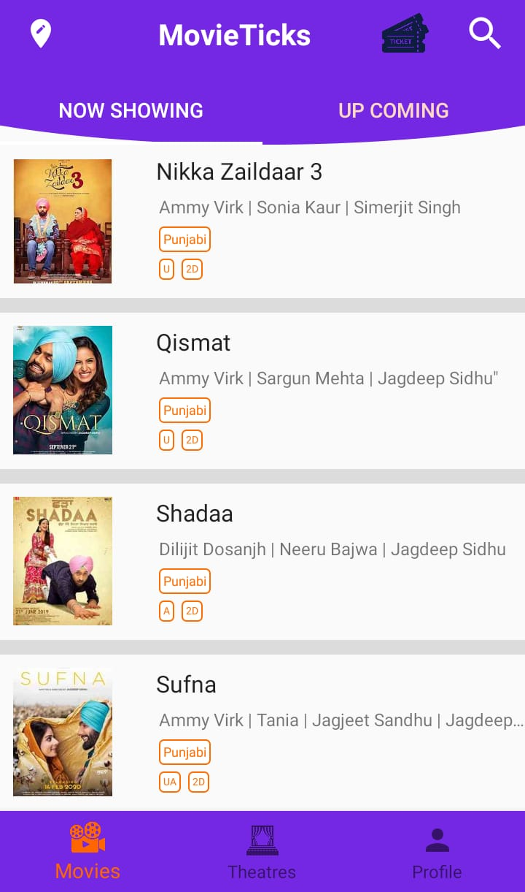
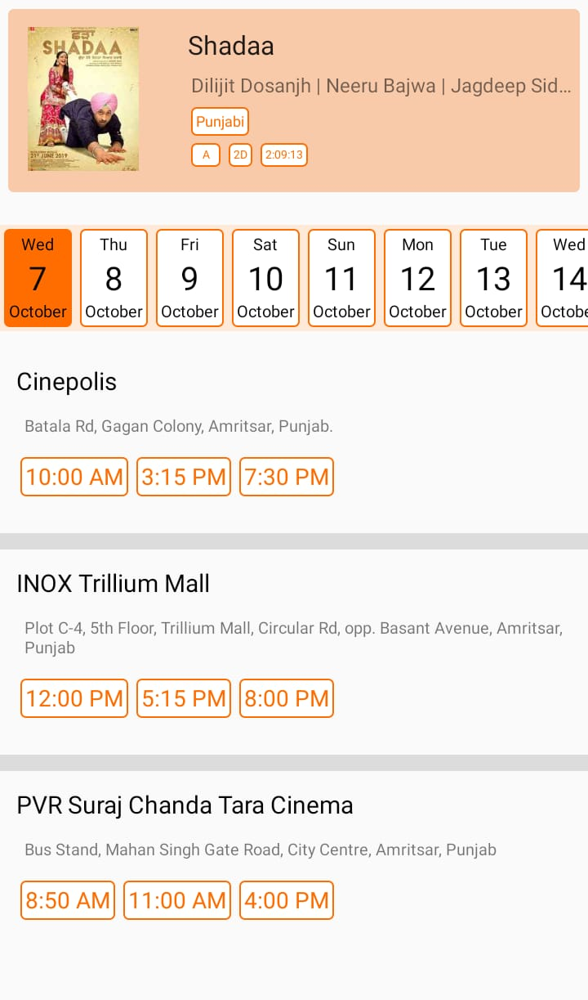
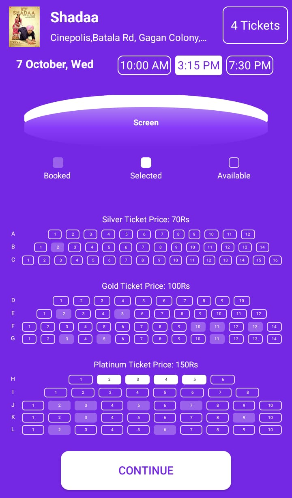
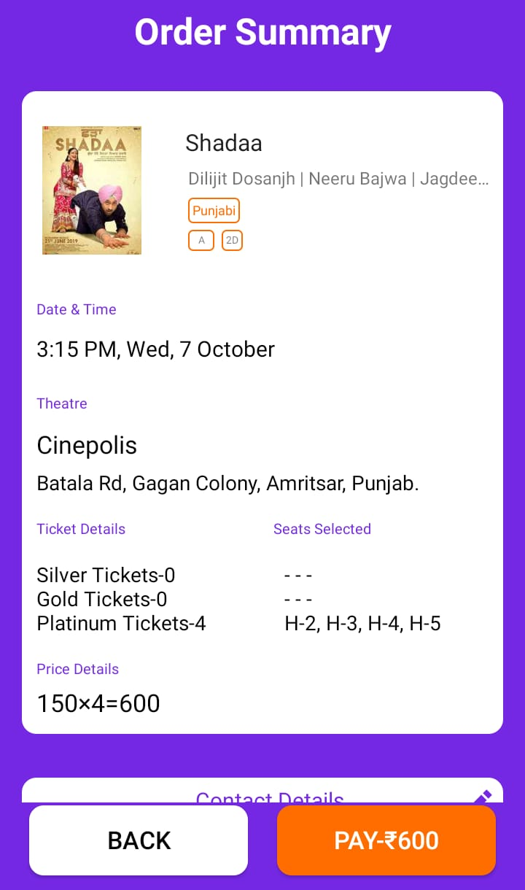
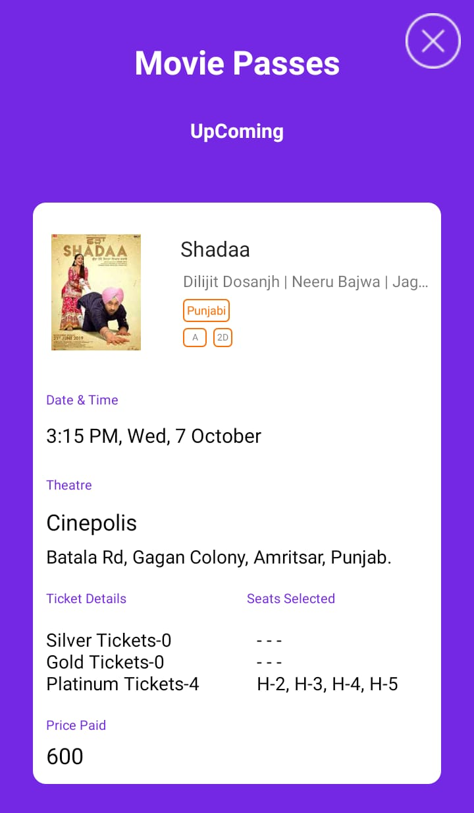
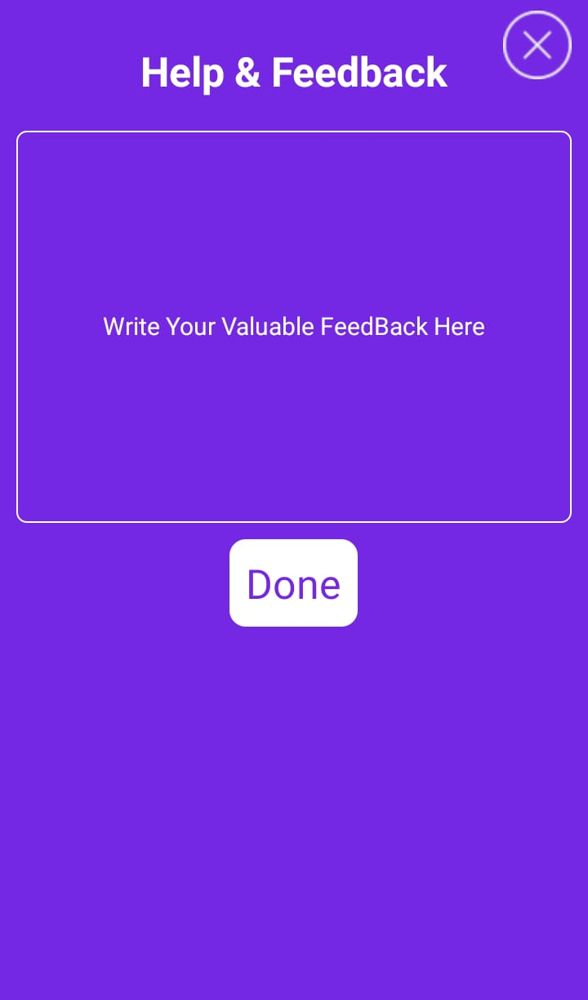

# 🎬 MovieTicks – Book Your Favorite Movies with Ease

MovieTicks is an Android-based movie ticket booking application built with **Android Studio**, **XML**, **Java (JDK)**, and **Firebase** for real-time data management.  
It allows users to explore movies, check show timings, select seats, and get a digital movie pass — all in one smooth experience!  

---
## 📊 Design & Workflow Overview

  

*High-level design and user journey of the MovieTicks app*

| Location & Permissions | Movie List Tab | Movie Details & Trailer |
|:----------------------:|:--------------:|:----------------------:|
|  |  |  |

| Show Timings & Theatre | Number of Seats | Seat Layout & Screen View |
|:---------------------:|:---------------:|:-------------------------:|
|  |  |  |

| Order Summary | Movie Passes & Tickets | Help & Feedback |
|:-------------:|:----------------------:|:---------------:|
|  |  |  |

---

## 🧩 Tech Stack

| 💻 Category | 🛠️ Technologies Used |
|:-------------|:----------------------|
| 🎨 **Frontend** | XML (UI Layouts) • Android Views • Material Components |
| ⚙️ **Backend** | Java (JDK 8+) • Firebase Realtime Database |
| 🧠 **IDE** | Android Studio |
| 🏗️ **Build Tool** | Gradle |
| 🔄 **Version Control** | Git • GitHub |

---

## ✨ Features

- 🎟️ **Movie Listings:** Browse latest and upcoming movies.  
- 🕒 **Show Timings:** Check cinema-wise and time-based listings.  
- 💺 **Seat Selection:** Interactive seat layout for real-time booking.  
- 🎫 **Order Summary & Pass:** Generate a digital movie pass with booking details.  
- 📍 **Location Detection:** Fetch nearby cinemas automatically.  
- 📽️ **Movie Trailers:** Watch trailers directly within the app.  
- 💬 **Help & Feedback:** Simple feedback section for user queries.

---

👨‍💻 Developer  
Deepak Kumar

💻 [GitHub](https://github.com/Deepak-9988)  
📸 [Instagram](https://www.instagram.com/dpk._.dk/)

---
